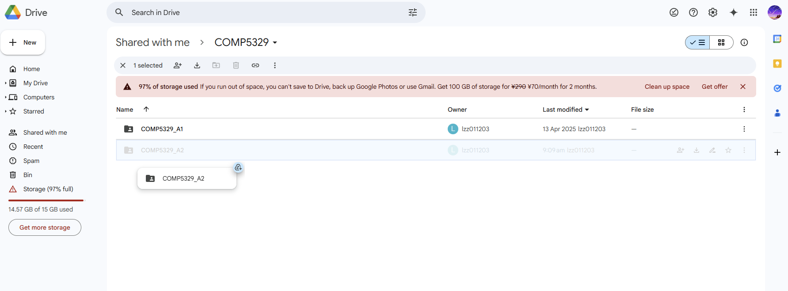
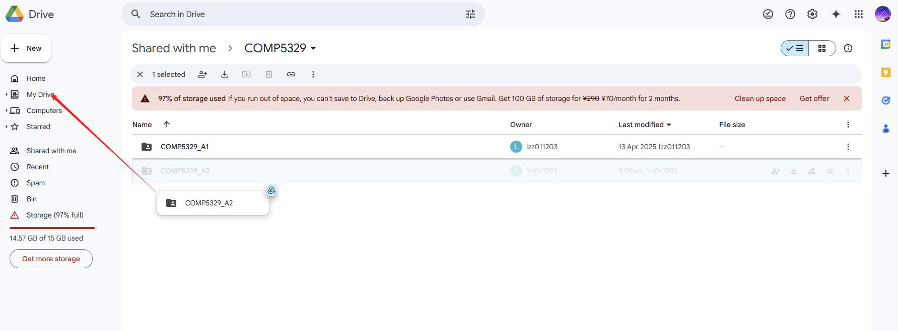
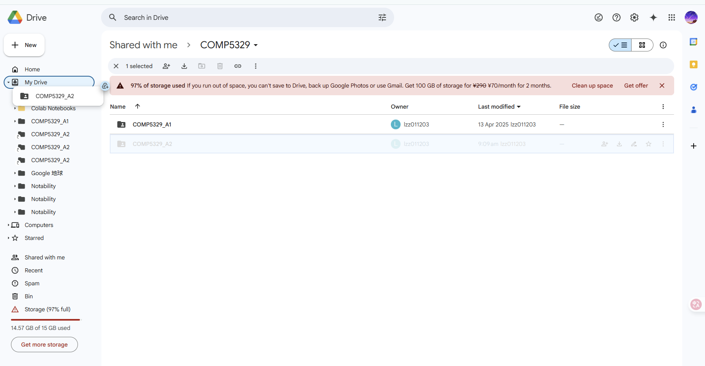
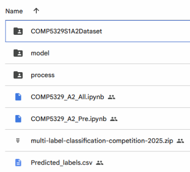

# Lightweight Multi-Modal Classification Using EfficientNet-B0 and MiniLM

## 🛠️ Running Instructions

### Step 1: Copy Dataset and Model Files to Google Drive

1. Open this shared Google Drive link:  
   👉 [COMP5329_A2 Shared Folder](https://drive.google.com/drive/folders/1E8OcgpVay_1RB-XrBSOKkBDs9LacFC-6?usp=drive_link)

2. Move the folder `COMP5329_A2` into your own Google Drive under `MyDrive`.  
   You can do this by dragging it as shown below:

   
   

3. After moving, you should see the folder inside your `MyDrive`:

   
---

### Step 2: Open and Run Code in Google Colab

1. Visit the GitHub repository:  
   🔗 https://github.com/szha0052/Lightweight-Multi-Modal-Classification-Using-EfficientNet-B0-and-MiniLM

2. Open the following notebooks:
   - `COMP5329_A2_All.ipynb` for full pipeline
   - `COMP5329_A2_Pre.ipynb` for inference only

 

3. Click “Open in Colab” and run the first code cell to mount your Google Drive:

  

---

### 📂 Folder Contents

The folder `COMP5329_A2` includes:

- `COMP5329S1A2Dataset`: Raw input and training data
- `process`: Preprocessed files
- `model`: Saved model checkpoints  
- `COMP5329_A2_All.ipynb`: Full training + inference pipeline
- `COMP5329_A2_Pre.ipynb`: Inference-only script
- `Predicted_labels.csv`: Submission output

